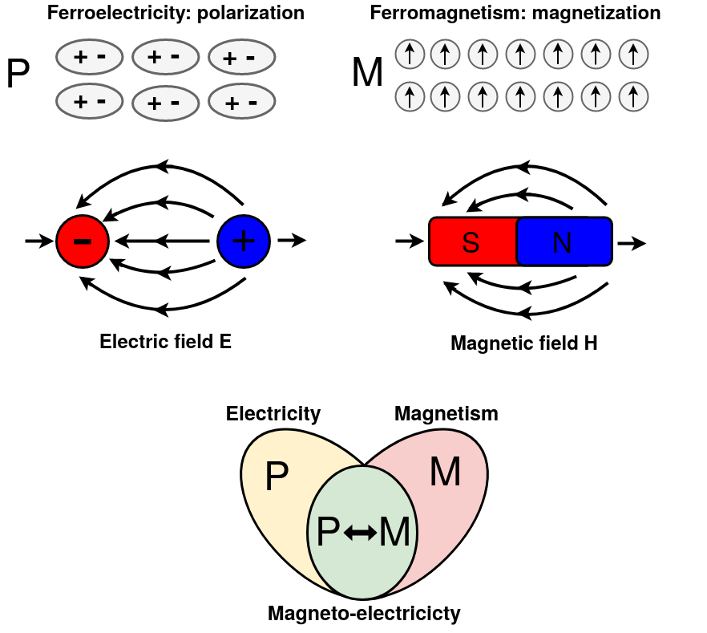

# Finite Differences Toolbox for Magneto-Electric coupling

Python3 re-implementation of [Finite Differences Toolbox](https://github.com/jcwojdel/FDToolbox) for calculation of magnetic, 
dielectric, and magnetoelectric response properties of simple materials. The code is interfaced with [Pymatgen](https://pymatgen.org/) 
(Python Materials Genomics) library to facilitate pre- and post-processing.

<p align="center">
  
</p>

The methodology for these calculations is described in the following references:

  - [Ab Initio Indications for Giant Magnetoelectric Effects Driven by
  Structural Softness]( http://dx.doi.org/10.1103/PhysRevLett.105.037208)
  Wojdel, Jacek C.; Iniguez, Jorge
  *Physical Review Letters* **105**, 037208 (2010)

  - [Magnetoelectric Response of Multiferroic BiFeO3 and Related Materials
  from First-Principles Calculations](http://dx.doi.org/10.1103/PhysRevLett.103.267205)
  Wojdel, Jacek C.; Iniguez, Jorge
  *Physical Review Letters* **103**, 267205 (2009)

  - [First-Principles Approach to Lattice-Mediated Magnetoelectric Effects](http://dx.doi.org/10.1103/PhysRevLett.101.117201)
  Iniguez, Jorge
  *Physical Review Letters* **101**, 117201 (2008)
  
  These articles should be cited if you use this code. 

  **Note:** the code computes ion- and lattice-mediated contributions to the spin component of magneto-electric response. 
  It does not compute the orbital component and the electronic contribution to the spin component of magneto-electric 
  response. 

## Computational procedure (example):

We assume that POSCAR file is in the ROOT directory.

**STEP 1** (*calculation*): Generate folders for the noSOC calculations: 
```
python3 examples/generate_nosoc.py
```
Run all calculations.

**STEP 2** (*calculation*): Generate folders for the polarization (noSOC) and magnetization (SOC) calculations:
```
python3 examples/compute_polarization_and_magnetization.py
```
Run all calculations.

**STEP 3** (*post-processing*): Compute the dielectric tensor:
```
python3 examples/compute_dielectric.py
```

**STEP 4** (*post-processing*): Compute the magnetoelectric tensor:
```
python3 examples/compute_magnetoelectric.py
```
